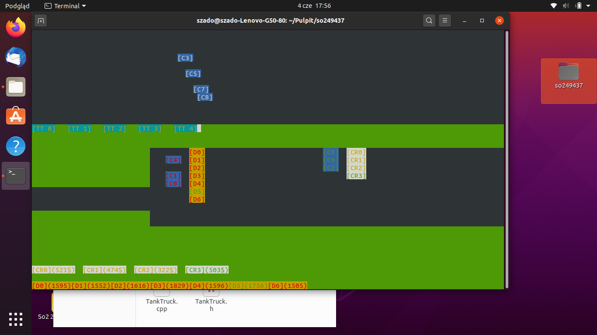

# GasStationSimulation
Project created to better understand threads in c++. 
Program simulate gas station with cars and tank truck as threads and fuel pumps and cash registers as a thread resources.
## Car thread
Car thread have 5 stages:
* driving (if car has enough fuel)
* waiting for any fuel pump to be free
* refueling
* waiting for any cash register to be free
* paying
## Tank Truck thread have 5 stages:
* Waiting till any fuel pump is empty
* Refueling its self with fuel
* Driving to Gas Station
* Refueling the pump
* Driving back

## Resource managment
Fuel pump and cash register can be used in one time only by one car.
Empty fuel pump can't be used by car.
The fuel pump is taken till the car end the paying process.
If all of the fuel pumps are taken or empty cars need to wait.
If all cash registers are taken cars need to wait.

## Example of simulation

[C*] - Car:
* White text - driving
* Yellow text - waiting
* Red text - refueling
* Green text - paying
[TT*] - Tank truck
* White text - driving
* Yellow text - waiting
* Red text - refueling
[CR*] - Cash Register
* Green text - it's free to use
* Yellow text - it's taken by car
[D*] - Fuel Pump
* Green text - it's free to use
* Purple text - it's empty
* Red text - it's taken by car or tank truck
